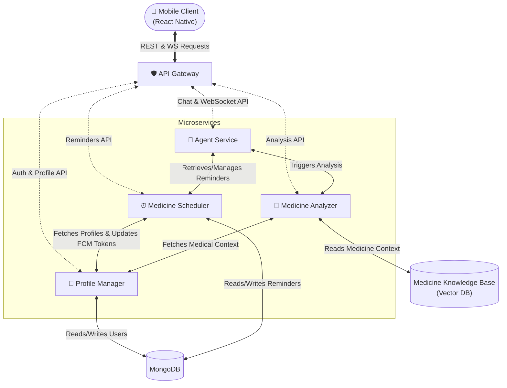

  <h1>🏥✨ AushadX</h1>
  
<strong>Your Personal AI Health Assistant.</strong>

  
<em>Smart Reminders. Intelligent Analysis. Secure Health Profiles.</em>

  <a href="#-overview">Overview</a> •
  <a href="#-key-features">Features</a> •
  <a href="#️-architecture">Architecture</a> •
  <a href="#-tech-stack">Tech Stack</a> •
  <a href="#-getting-started">Getting Started</a>

---

## 🚀 Overview

**AushadX** is a cutting-edge, microservices-based health management platform designed to empower users to take control of their well-being. By combining robust scheduling algorithms with advanced generative AI, AushadX doesn't just remind you to take your medicine—it understands your health context.

Whether you're managing a complex medication schedule, tracking health trends, or seeking instant answers to medical questions based on your personal reports, AushadX is your always-on intelligent companion.

## 🌟 Key Features

### 📅 **Smart Medication Scheduling**

Never miss a dose again. Our robust scheduler handles complex frequencies:

- **Flexible Timing**: Every X hours, specific days, or X times daily.
- **Intelligent Tracking**: Logs missed doses and adheres to strict end-date policies.
- **Reliable Notifications**: Push notifications ensure you're always alerted on time.

### 🧠 **AI-Powered Health Analysis**

Transform your medical data into actionable insights:

- **RAG-Enhanced Q&A**: Upload medical reports (PDF/Text) and ask questions. Our **Retrieval-Augmented Generation** engine retrieves the exact context to give you accurate answers.
- **Gemini Integration**: Powered by Google's Gemini Pro for state-of-the-art medical reasoning.
- **Personalized Analytics**: Get dietary advice, risk assessments, and exercise plans tailored to your specific profile.
- **Conversational AI**: Interact with our Agent Service via WebSocket for a seamless health assistant experience.

### 🛡️ **Secure Profile Management**

Your health data is sensitive, and we treat it that way:

- **Centralized Auth**: Secure JWT-based authentication across all services.
- **Encrypted Data**: Standards-compliant password hashing and secure token management.
- **Profile Portability**: Seamlessly syncs user context across the scheduler and analyzer services.

---

## 🏗️ Architecture

AushadX is built as a scalable **Microservices Ecosystem**, orchestrating specialized services for maximum reliability and separation of concerns.

### 🛣️ API Routing & Endpoints Topology

The **API Gateway (Port 3000)** securely proxies and routes all cross-origin requests to the internal microservices while performing global JWT token validation and injecting headers.

| Gateway Route | Target Microservice    | Internal Port | Key Responsibilities & Endpoints                                              |
| :------------ | :--------------------- | :------------ | :---------------------------------------------------------------------------- |
| `/auth`       | **Profile Manager**    | `3001`        | _Public:_ `/signup`, `/login`, `/refresh`, OTP & Password Resets.             |
| `/profile`    | **Profile Manager**    | `3001`        | _Protected:_ Profile CRUD, `/medical-info/:uid`, FCM tokens.                  |
| `/analyze`    | **Medicine Analyzer**  | `3002`        | _Protected:_ Analyzes medical files (Proxied to `/api/analyze/:uid`).         |
| `/reminders`  | **Medicine Scheduler** | `3003`        | _Protected:_ Schedule CRUD, list pending/missed, snooze, clear dosings.       |
| `/chats`      | **Agent Service**      | `3004`        | _Protected:_ HTTP fetches for chat history, sending messages, deletions.      |
| `/ws`         | **Agent Service**      | `3004`        | _WebSockets:_ Bi-directional real-time medical assistant AI streaming via WS. |

### Microservices Details

- **`api-server`**: Main entry point handling API rate-limiting, proxy routing, and Auth Header injection (`X-User-Id`). Supported timeouts configured individually per proxied route.
- **`profile-manager`**: Centralized user data handling and secure JWT generation/verification natively in MongoDB.
- **`medicine-analyzer`**: AI service utilizing models to parse, vectorize, and analyze user prescription/report data.
- **`medicine-scheduler`**: Robust background processor triggering medicine notifications with Agenda.js.
- **`agent-service`**: Stateful intelligent assistant service maintaining active WebSockets for conversational health advice.

---

## 🛠️ Tech Stack

- **Mobile Client**: React Native (Expo)
- **Runtime**: Node.js & Python
- **Databases**: MongoDB (Document store), Vector Database (for AI context)
- **AI & ML**: Google Gemini Pro, LangChain/LangGraph, RAG pipelines
- **Scheduling**: Agenda.js (Robust job scheduling)
- **Security**: JWT (JSON Web Tokens), Bcrypt
- **Infrastructure**: Docker Desktop & Kubernetes

---

## 🚀 Getting Started

AushadX is designed to run natively on **Docker Desktop's built-in Kubernetes**. It utilizes persistent internal volumes for MongoDB and scales its microservices securely without requiring external databases.

👉 **[Click here for the complete Kubernetes Deployment Guide](k8s/DEPLOYMENT.md)**

The step-by-step deployment guide covers:

- Switching to the correct Kubernetes context
- Building local images without needing an external registry
- Safely configuring environment variables & secrets via Kubernetes manifestations
- Setting up the React Native mobile client to communicate with the Gateway on NodePort `30000`

---

## 🤝 Contributing

We welcome contributions! Please see our [CONTRIBUTING.md](CONTRIBUTING.md) for details on how to submit pull requests, report issues, and request features.

## 📄 License

This project is licensed under the MIT License - see the [LICENSE](LICENSE) file for details.

---

  Built with ❤️ by the AushadX Team

